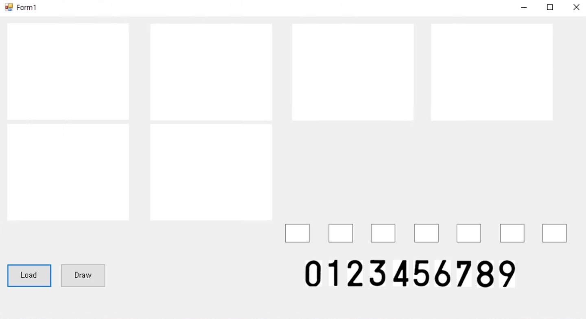
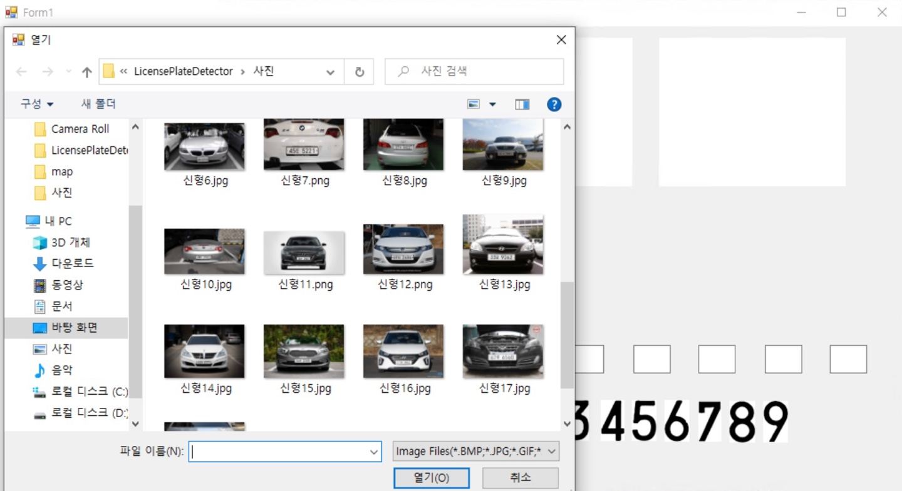
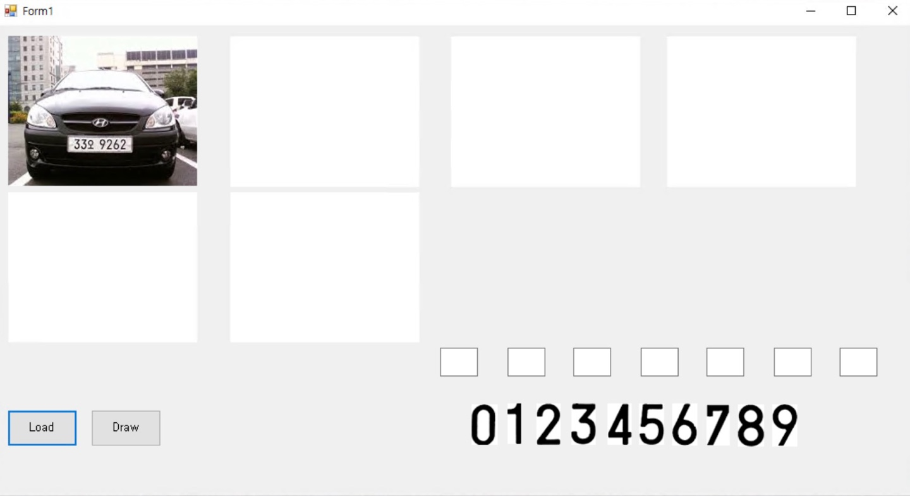
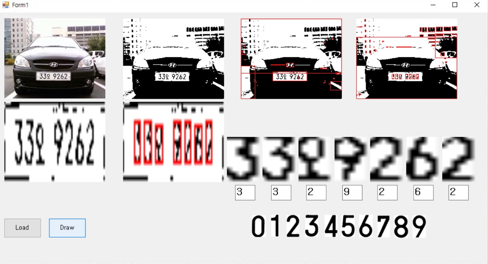
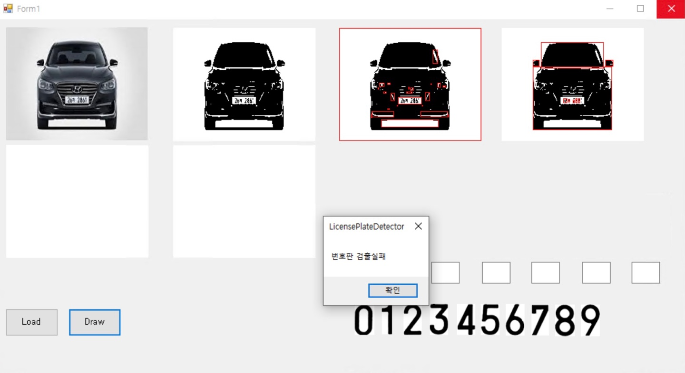

# 3G2S-ImageProcessing
The purpose of this project is to detect license plate. <br/>
This project was carried out in a Digital-Image-Processing lecture in the second semester of my third year. <br/>
This lecture gave me the opportunity to implement a computer vision libraries.
**(GrayScale, Threshold, GaussianBlur, Canny Edge, ... etc.)** <br/>

#### ⇩ Click Below Video ⇩
[](https://www.youtube.com/watch?v=ikGXJtXI_yg) <br/>

## 1. Requirments
Code is written in Visual Basic requires:
* _Nothing_

----------

## 2. Demonstration
**1) Main** <br/>
> 

**2) Select Image**
> 

**3) Load Image**
> 

**4) Detection Success**
> 

**5) Detection Failed**
> 

----------

## 3. Limit
**1) Character Recognition Problem**
```
It couldn't recognize character.
```

**2) Low Recognition Rate Problem**
```
Recognition rate is about 70 to 80 %
```

**3) Long Calculation Time Problem**
```
It's not suitable for real time. 
```
